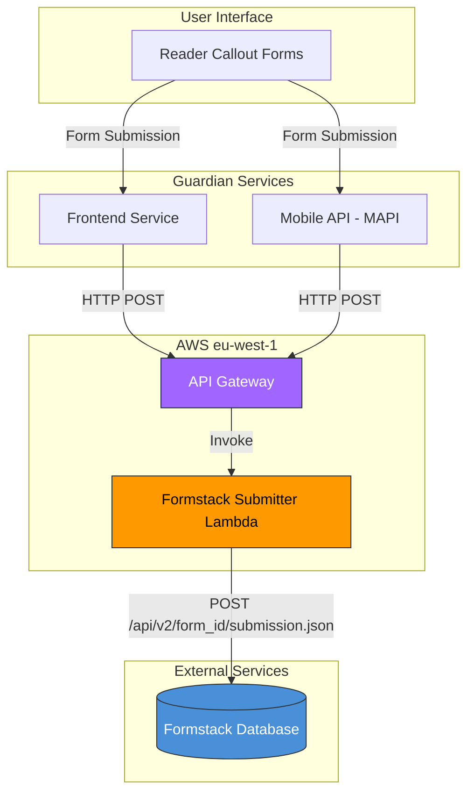
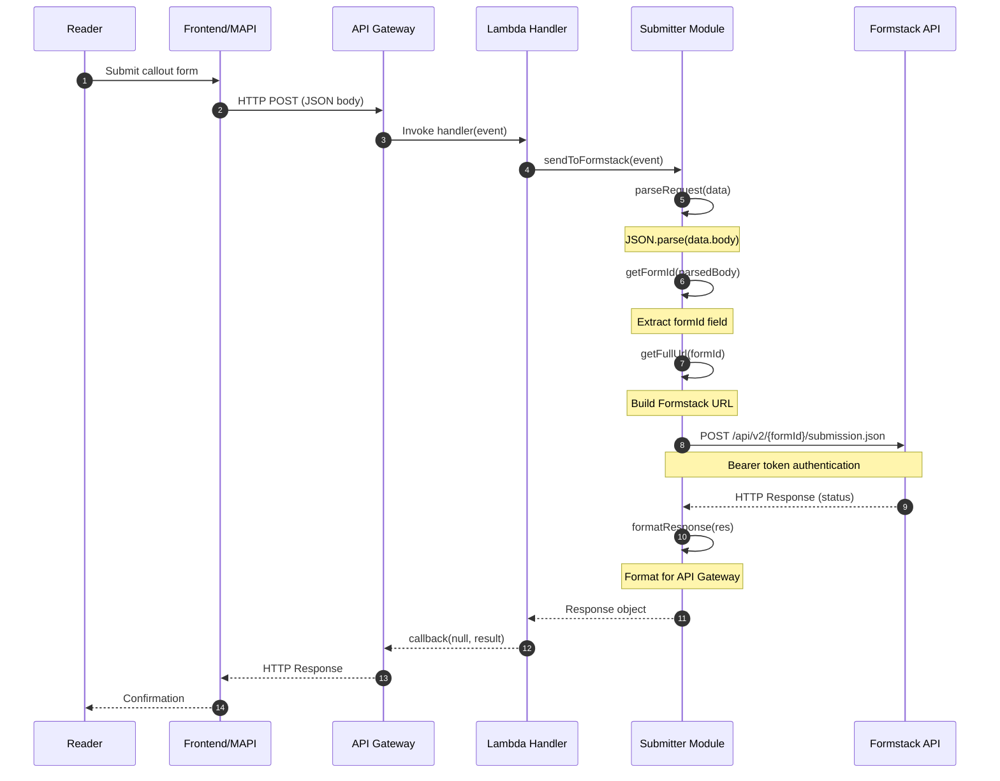
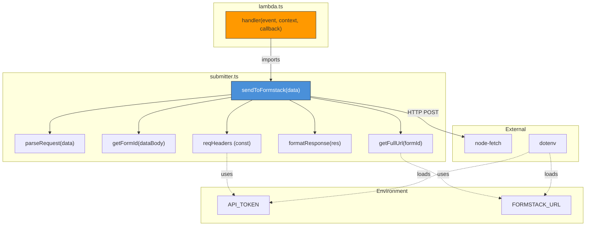
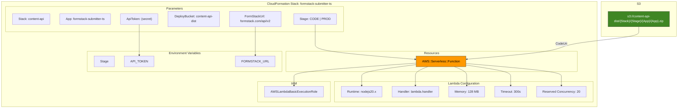
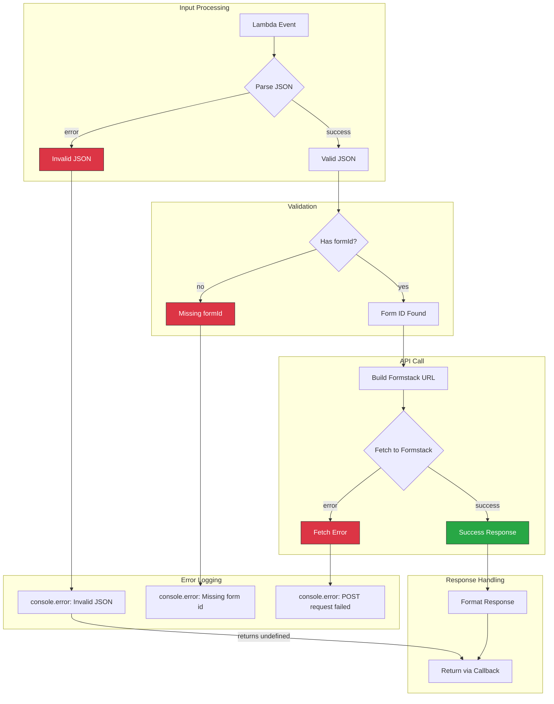
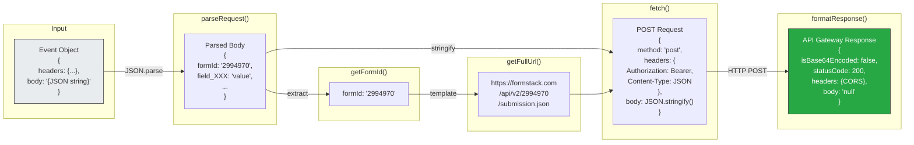
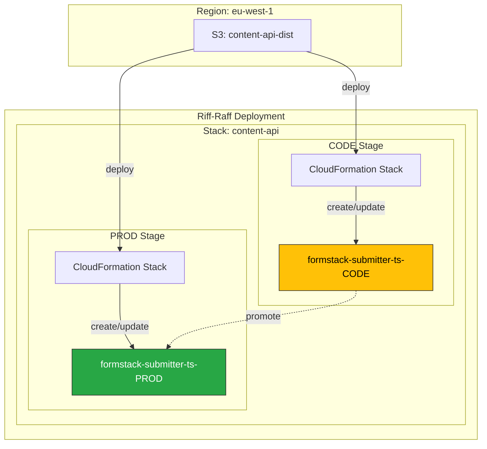

# Architecture Diagrams

This document contains Mermaid diagrams illustrating the Formstack Submitter architecture.

## Table of Contents

1. [High-Level System Architecture](#high-level-system-architecture)
2. [Request Processing Flow](#request-processing-flow)
3. [Lambda Function Internal Structure](#lambda-function-internal-structure)
4. [AWS Infrastructure](#aws-infrastructure)
5. [CI/CD Pipeline](#cicd-pipeline)
6. [Error Handling Flow](#error-handling-flow)

---

## High-Level System Architecture

This diagram shows how the Formstack Submitter fits into The Guardian's ecosystem.

---

## Request Processing Flow

This sequence diagram shows the complete flow of a form submission request.

---

## Lambda Function Internal Structure

This diagram shows the module structure and function relationships.

---

## AWS Infrastructure

This diagram shows the AWS resources defined in CloudFormation.

---

## CI/CD Pipeline

This diagram shows the build and deployment process.

```mermaid
flowchart LR
    subgraph "Development"
        Code[Source Code]
        Git[Git Repository]
    end

    subgraph "TeamCity CI"
        subgraph "teamcity.sh"
            NVM[Setup NVM]
            Yarn[Install Yarn]
            Deps[Install Dependencies]
            Build[TypeScript Compile]
            Prepare[Prepare Target]
            Package[Create Artifact]
        end
    end

    subgraph "Riff-Raff"
        Upload[Upload to S3]
        CFDeploy[CloudFormation Deploy]
        LambdaDeploy[Lambda Deploy]
    end

    subgraph "AWS eu-west-1"
        S3[(S3 Bucket)]
        CF[CloudFormation]
        LambdaFn[Lambda Function]
    end

    Code -->|commit| Git
    Git -->|trigger| NVM
    NVM --> Yarn
    Yarn --> Deps
    Deps --> Build
    Build --> Prepare
    Prepare --> Package

    Package -->|artifact| Upload
    Upload --> S3
    S3 --> CFDeploy
    CFDeploy --> CF
    CF --> LambdaDeploy
    LambdaDeploy --> LambdaFn

    style Build fill:#3178c6,stroke:#333,color:#fff
    style LambdaFn fill:#ff9900,stroke:#232f3e,color:#000
    style S3 fill:#3f8624,stroke:#333,color:#fff
```

---

## Error Handling Flow

This diagram shows how errors are handled throughout the system.

---

## Data Flow Diagram

This diagram shows the data transformations at each step.

---

## Deployment Stages

